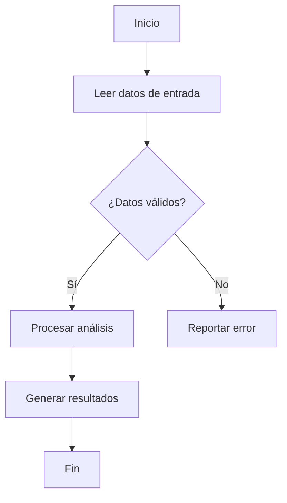
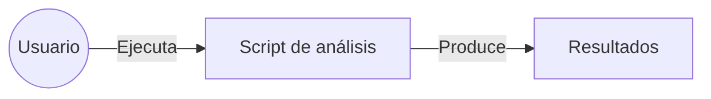

## Plantillas Sugeridas

A lo largo del curso se utilizará una **plantilla ligera y uniforme** de documentación. Esta plantilla busca garantizar claridad, reproducibilidad y buen uso de herramientas de IA, sin introducir una carga excesiva de documentación formal.

La documentación se organizará por fases del desarrollo de software.

---

### Documento de contexto (Requisitos + Análisis y Diseño)

Este documento define el **contexto del problema** y el **contexto de la solución**. Puede implementarse como un archivo `README.md`, un documento Markdown independiente o una sección inicial de un notebook.

**Estructura recomendada:**

```markdown
# Nombre del proyecto

## 1. Descripción del problema
Describir brevemente el problema científico o computacional que se desea resolver.

## 2. Objetivo del software
Indicar qué se espera que haga el programa.

## 3. Requisitos funcionales
- Función o comportamiento esperado 1
- Función o comportamiento esperado 2

## 4. Requisitos no funcionales
- Reproducibilidad
- Restricciones de entorno
- Consideraciones de legibilidad o rendimiento

## 5. Supuestos y limitaciones
- Supuestos realizados sobre los datos o el problema
- Limitaciones conocidas del enfoque

## 6. Análisis del problema
Descomposición del problema en pasos o etapas.

## 7. Diseño de la solución
Descripción general del flujo de trabajo, módulos o funciones principales.

## 8. Diagramas (opcional pero recomendado)
Incluir diagramas Mermaid que ayuden a entender el sistema.
```

---

### Diagramas con Mermaid (ejemplos)

**Diagrama de flujo del análisis:**



**Caso de uso simplificado:**



---

### Documento de casos de prueba

Este documento define cómo se verificará el comportamiento del software. Puede ser un archivo Markdown independiente.

**Estructura recomendada:**

```markdown
# Casos de prueba

## Caso 1: Caso normal
- Entrada: descripción de los datos de entrada
- Procedimiento: qué se ejecuta
- Resultado esperado: salida esperada
- Justificación: por qué este caso es relevante

## Caso 2: Caso límite
- Entrada: condición extrema o no esperada
- Procedimiento: qué se ejecuta
- Resultado esperado: comportamiento esperado del sistema
- Justificación: qué valida este caso
```

Los **casos límite son obligatorios** en todas las prácticas.

---

### Documentación interna del código

El código debe incluir documentación interna mínima pero clara:

- Comentarios que expliquen decisiones relevantes
- Docstrings en funciones o módulos
- Supuestos importantes sobre entradas o salidas

**Ejemplo de docstring:**

```python
def calcular_estadisticas(datos):
    """
    Calcula estadísticas básicas a partir de un conjunto de datos.

    Parámetros:
    datos (list): Lista de valores numéricos.

    Retorna:
    dict: Diccionario con estadísticas calculadas.
    """
```

---

### Relación con el uso de IA

Toda la documentación generada en estas plantillas constituye el **contexto que se utiliza para interactuar con herramientas de IA**. Un contexto claro mejora la calidad del código generado y facilita su validación mediante pruebas.

El estudiante es responsable de:
- Definir el contexto
- Evaluar el código generado
- Validar el comportamiento del software mediante pruebas

Esta plantilla será el **estándar oficial del curso**.
