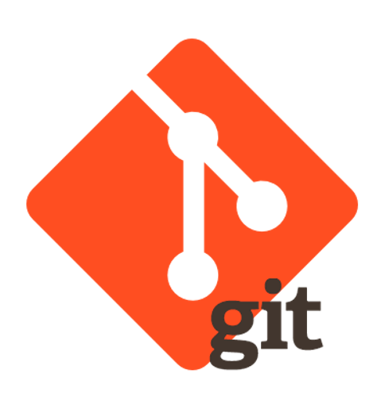
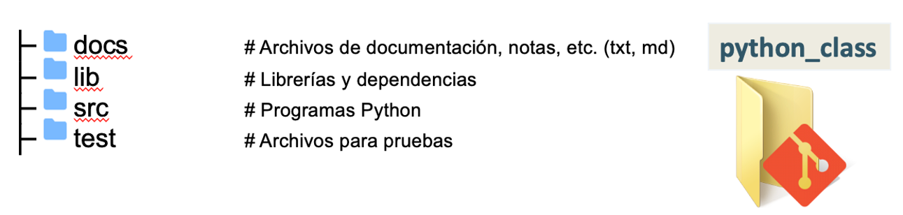
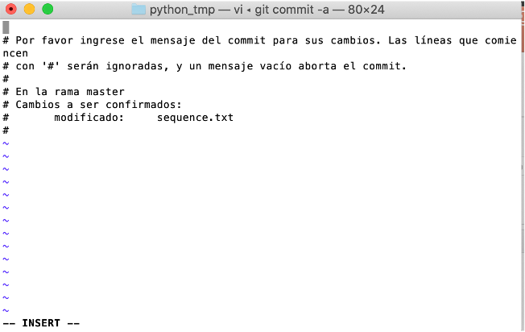
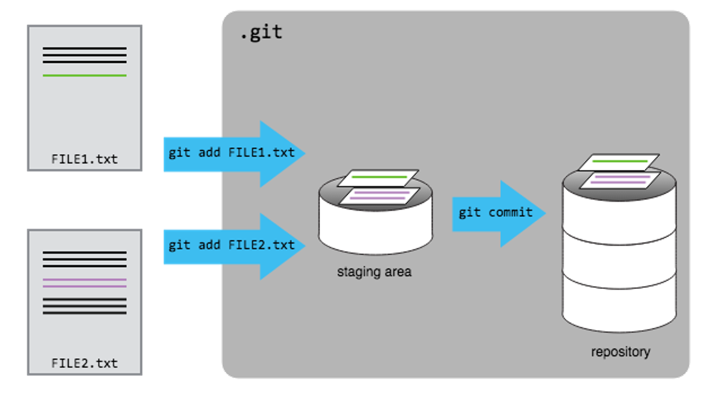

```{r setup, include=FALSE}
knitr::opts_chunk$set(echo = FALSE)
```


```{css, echo = FALSE}
/* From https://github.com/yihui/xaringan/issues/147  */
.scroll-output {
  height: 80%;
  overflow-y: scroll;
}
/* https://stackoverflow.com/questions/50919104/horizontally-scrollable-output-on-xaringan-slides */
pre {
  max-width: 100%;
  overflow-x: scroll;
}
```


## Contenido

1. Introducción  
2. Controlador de versiones  
3.  Git  
4. Comenzando a trabajar con Git  
4.1. Instalar y configurar Git  
4.2. Esquema de trabajo de Git  
4.3. Crear un repositorio  
4.4. Inicializar repositorio  
4.5  Crear un programa y agregarlo a git  
4.6. Commit  
4.7. Explorando el historial  
4.8. Comparando archivos  
4.9. Ignorando archivos  
---

# Git

## Objetivo
Al finalizar la lección, podremos llevar el control de las modificaciones que realicemos en nuestros programas, así como identificar cuáles fueron los cambios realizados y las fechas en que ocurrieron, todo esto haciendo uso de Git como controlador de versiones.


---

## Introducción
__Vamos a comenzar a hacer software, pero… ¿qué queremos lograr con el desarrollo de software?__

- Resolver algún problema  

- Que nuestro código pueda ser utilizado por otras personas  

- Que el software sea fácil de entender por mi y por los demás  

- Que sea fácil realizar modificaciones  

- ¡Colaborar con más gente!  

---

## Introducción  

__Para lograrlo necesito...__

- Utilizar estándares de codificación  
  - PEP8 para Python  
  - Guías de estilo de Google https://google.github.io/styleguide/   


- Utilizar notaciones o estándares de nombrado  
  - Camel case  
  - Upper case  

- Buenas prácticas  
  - Encabezado de programas  
  - Documentación interna  
  - Nombrado adecuado de variables y métodos/funciones  
  - Nombrado adecuado de los programas  
  - Organización adecuada del código (carpetas y archivos)  
  - Compartir el código con mis compañeros para obtener retroalimentación  

- Control de versiones del código  


---

## ¿Qué es Markdown?  


__Ventajas de usar Markdown__  

- Escribir para web es más rápido y cómodo. Una vez que te acostumbras y conoces la sintaxis, completas el texto más rápido.  

- Facilidad de uso debido a la sintaxis que emplea.  

- Es más difícil cometer errores de sintaxis.  

- Es perfecto para usarlo con editores de texto minimalistas.  

- Puede compartirse fácilmente entre computadoras, entornos moviles, etc., quedando resuelto de este modo la incomodidad de dar formato a un texto a través de los sistemas  diferentes sistemas donde se encuentre.  

---

## Control de versiones

```{r, out.width = "750px",fig.align='center'}
knitr::include_graphics("img/versiones.png")
```

---

## Control de versiones 

```{r, out.width = "500px",fig.align='center'}
knitr::include_graphics("img/documento.png")
```

---

## Control de versiones 

```{r, out.width = "450px",fig.align='center'}
knitr::include_graphics("img/word.gif")
```

---

## ¿Cómo puedo controlar mi código? 

__Forma manual__

El versionamiento está constituido por dos dígitos, versiones primarias y secundarias (X.Y).

```{r, out.width = "150px",fig.align='right'}
knitr::include_graphics("img/versionManual.png")
```

Reglas:

```{r, out.width = "650px",fig.align='left'}
knitr::include_graphics("img/reglas.png")
```

---


## ¿Cómo puedo controlar mi código? 

__Forma manual__ 

Aplicando las reglas...  

- Agregar línea de código (algunos print, comentarios internos):   myScript_v0.1.py  

- Cambiar el nombre de una variable:                               myScript_v0.2.py  

- Borrar varias funciones del código:                              myScript_v0.3.py  

- Agregar un método:                                               myScript_v1.0.py  


---


## ¿Cómo puedo controlar mi código? 

__Forma automática__  
por medio de un sistema de control de versiones.  

```{r, out.width = "450px",fig.align='center'}
knitr::include_graphics("img/controladores.png")
```
    

---

## ¿Cómo puedo controlar mi código? 

Un sistema de control de versiones es una herramienta que se encarga por nosotros de __controlar__ todos los cambios que realicemos en nuestros programas, creando __diferentes versiones de nuestros archivos__.  

Además, nos permite decidir cuales cambios serán aplicados para la siguiente versión (cada registro de estos cambios es llamado como commit), además de presentar metadatos acerca de ellos.  

Los sistemas de control de versiones no son nuevos. Herramientas como CVS, o Subversion han estado presentes desde inicios de 1980. Sin embargo, estos han sido considerados anticuados debido a limitaciones en sus capacidades. Actualmente, existen modernos sistemas como Git y Mercurial, que incluyen poderosas herramientas para el trabajo colaborativo y concurrente en los archivos. 


---

## ¿Cómo puedo controlar mi código? 

- Usar un sistema de control de versiones es como si tuvieramos un “undo”o “deshacer” ilimitado.  

- Un sistema de control de versiones también permite que muchas personas trabajar en paralelo.  

```{r, out.width = "250px",fig.align='right'}
knitr::include_graphics("img/admiracion.png")
```

---

## Pero… ¿Qué es Git?

- Es un sistema de control de versiones para rastrear los cambios de nuestro código durante el desarrollo del software.  

- Está diseñado para coordinar el trabajo entre los programadores o contribuidores.  

- Puede ser utilizado para rastrear los cambios en otros tipos de archivos de texto plano.  
  
```{r, out.width = "250px",fig.align='right'}

```

---

## ¿Cómo trabajo con Git? 

__Git de manera local:__  
- Solo yo puedo tener acceso al código  
- Puedo controlar en mi computadora los cambios que haga al código  
- Mi sotfware se vuelve solo de uso personal  

__Git + GitHub:__ 
- Permitiendo trabajar conjuntamente en una idea  
- Formar una comunidad de varias personas trabajando en un fin común  
- Contribuir a mejorar el código  
- Acceso al código, leerlo, estudiarlo y aprender de él, e incluso hacer cambios y experimentar sin afectar el código original  


---


## Trabajando con Git y GitHub 

```{r, out.width = "750px",fig.align='center'}
knitr::include_graphics("img/git-github.png")
```

---

## Comenzando a trabajar con Git 

1. Instalar y configurar Git  
2. Esquema de trabajo de Git  
3. Crear un repositorio  
4. Inicializar repositorio  
5. Crear un programa y agregarlo a git  
6. Commit  
7. Explorando el historial  
8. Comparando archivos  
9. Ignorando archivos  
.  

```{r, out.width = "450px",fig.align='center'}
knitr::include_graphics("img/gitLocal.png")
```

---

## Instalación de Git 

Revisar si Git está instalado  

- Abrir una terminal (símbolo del sistema en windows):  
- Ejecutar el comando:  

`git --version`  

Si Git no está disponible...  

_Windows:_  <https://gitforwindows.org/>  

_MacOS:_ <https://git-scm.com/download/mac>   

_Linux:_ 
Debian/Ubuntu:`sudo apt-get install git`  
Fedora:`sudo dnf install git`


---

## Configuración de Git

Definiendo mi nombre y correo electrónico:  

`git config --global user.name ”[tuNombre]”`  
`git config --global user.email [tuEmail]`  

El username e email estarán asociados a las siguientes actividades con Git, así como con la interacción GitHub, por lo que se sugiere que el email que se defina sea el mismo que se utilice al momento de crear nuestra cuenta de GitHub.

Para ver los valores de configuración de Git:  
`git config --list`


---


## Esquema de trabajo de Git


```{r, out.width = "650px",fig.align='center'}
knitr::include_graphics("img/esquemaGit.png")
```

_Repositorio_: carpeta que contiene el seguimiento de los cambios que se realicen en el código. 

---

## Creando un repositorio controlado por Git

- Definir la ruta de trabajo  
`/Users/tuUsuario/Desktop`  

- Crear una carpeta  
`mkdir python_class`  

- Entrar a la carpeta  
`cd python_class`  

- Crear la estructura interna  
`mkdir docs lib src test`  

__Buenas prácticas__  
Seguir una estructura de organización de carpetas y archivos para nuestros proyectos.

```{r, out.width = "650px",fig.align='center'}

```


---

## Creando un repositorio controlado por Git

- Inicializar el repositorio Git  
`git init`  

- Revisar el repositorio  
`ls -la`  

- Comprobar repositorio  
`git status`  

```{r, out.width = "750px",fig.align='center'}
knitr::include_graphics("img/gitInit.png")
```


---

##  Actividad

Imaginemos que dentro del directorio `python_class`:

\# Creamos un sub-directorio llamado analysis  
`$ mkdir analysis`  

\# Vamos al directorio analysis  
`$ cd analysis`  

\# Inicializamos un repositorio Git  
`$ git init`  


__¿Les parece que esta sea una buena idea?__

```{r, out.width = "200px",fig.align='left'}
knitr::include_graphics("img/pensando.png")
```


---

## Creando un repositorio controlado por Git

`git init` inicializa un repositorio Git.


Git almacena y controla todos los cambios que se hagan en el contenido del repositorio mediante el directorio `.git`

```{r, out.width = "150px",fig.align='center'}
knitr::include_graphics("img/admiracion.png")
```

---

##  Controlando los cambios con Git

1.  Entrar al directorio  			
`cd python_class`

2. Descargar de la plataforma de cursos la carpeta data-git  

3. Copiar el programa: reverse-complement.py  
`cp ../../Downloads/data-git/reverse-complement.py ./src/`  

4. Indicar a Git que controle los cambios de mi programa  
`git add reverse-complement.py`

5. Confirmar los cambios realizados  		
`git commit –m “Mensaje”`


---

##  Controlando los cambios con Git

```{r, out.width = "750px",fig.align='center'}
knitr::include_graphics("img/flujoGit.png")
```

---

## Resumen

- Git: sistemas de control de versiones  
- Esquema de trabajo de Git  
```{r, out.width = "450px",fig.align='center'}
knitr::include_graphics("img/esquemaGit2.png")
```

__Comandos Git:__

`git init` inicializar repositorio Git

`git add` agregar y dar seguimiento a los archivos del repositorio Git

`git commit –m “Mensaje”` Formalizar/asegurar los cambios realizados en el repositorio


---

## Definiendo un buen mensaje para el commit

_CLAVE_: Escribe un mensaje que describa con precisión los cambios que se han realizado.  

Los buenos mensajes de commit comienzan con una breve declaración (<50 caracteres) sobre los cambios realizados.  

Si se deseas profundizar en el mensaje se recomienda:  

- Usar `git commit –a` 
- Separar el asunto y cuerpo del commit  
- Limitar el asunto del commit a una línea de 50 caracteres  
- Definir el cuerpo del commit a 72 caracteres  
- En el cuerpo del commit explicar qué y por qué  


```{r, out.width = "250px",fig.align='center'}

```


<https://chris.beams.io/posts/git-commit/>

---


## Algunas preguntas...

__¿Una vez creado el repositorio Git puedo moverlo a una nueva ubicación?__  

Si, mientras el directorio .git no se vea afectado, Git seguirá controlando los cambios en el repositorio sin importar que se haya movido a otro lugar.  


__¿Puedo modificar el mensaje de un commit?__  

Si. Puedes podificar el mensaje del commit más reciente:

`git commit --amend -m ”Mensaje”`


---


## Comparando cambios

- Modificar el programa: reverse-complement.py  
`$ nano reverse-complement.py`

- Modificar el encabezado del programa, sección Usage:  
`FILENAME`

- Guardar los cambios  
`ctrl+x`


---

## Comparando cambios

- Comparar las versiones del programa: reverse-complement.py  
`$ git diff`


- Agregar el programa y hacer commit de los cambios  

`$ git add reverse-complement.py`  

`$ git commit - m “mensaje”`


```{r, out.width = "550px",fig.align='center'}
knitr::include_graphics("img/diff.png")
```
---

## Comparando cambios

Volvamos a modificar el archivo reverse-complement.py  
`$ nano reverse-complement.py` 

Modificar el encabezado del programa agregando el archivo de entrada (sección example)  
`% python reverse-complement –i sequence.txt`

Guardar los cambios  
`ctrl+x` 

Comparemos las versiones (diff)  
`git diff`

Ahora usemos  
`$ git diff --staged`


---

## Comparando cambios

¿Por qué no hay ninguna salida?

---

## Comparando cambios

¿Por qué no hay ninguna salida?

```{r, out.width = "650px",fig.align='center'}
knitr::include_graphics("img/diffstaged.png")
```
---

## ¿Qué hemos hecho hasta el momento?

`git log` lista todos los commits realizados en el repositorio en orden cronológico inverso.  

`git log –N` donde N indica el número de commits que queremos obtener.  

```{r, out.width = "650px",fig.align='center'}
knitr::include_graphics("img/gitlog.png")
```

---

## ¿Qué hemos hecho hasta el momento?

`git log --oneline` información reducida  

```{r, out.width = "650px",fig.align='center'}
knitr::include_graphics("img/gitOneline.png")
```

---


## Ramas en Git

Una rama Git es un apuntador que nos permitirá hacer referencia a cada una de las confirmaciones (commits). La rama por defecto de Git es la rama master.  

```{r, out.width = "550px",fig.align='center'}
knitr::include_graphics("img/ramas.png")
```

---

## Ramas en Git

La rama __master__ en Git se crea por defecto al usar el comando git init.  
 
```{r, out.width = "250px",fig.align='center'}
knitr::include_graphics("img/ramas.png")
```

- __develop__: En esta rama se van integrando todas las nuevas características hasta la siguiente release.  
- __feature-X__: Cada nueva mejora o característica que vayamos a introducir en nuestro software tendrá una rama que contendrá su desarrollo. Las ramas de _feature_ salen de la rama _develop_ y una vez completado el desarrollo de la mejora, se vuelven a integrar en _develop_.  
- __hotfix-X__: Si nuestro código contiene bugs críticos que es necesario arreglar de manera inmediata.  

---

## Controlando más de un archivo

```{r, out.width = "750px",fig.align='center'}

```


---

## ¿Cómo identifico el estado de mi repositorio Git?

`git status`  

indica el estado de los archivos que pueden ser controlados por Git, o aquellos que ya están controlados pero se han modificado.


---


## Actividad

Mover el archivo de notas (markdown) creado anteriormente al directorio docs/  
`cp ../../Notas.md ../docs/` 

Conocer el estado del repositorio  
`git status` 

Identificar archivos sin seguimiento  
`git status -u`  


---


## Actividad

- ¿Cuál de los siguientes comandos guardaría los cambios del archivo myfile.txt a mi repositorio local de Git?  

1. `$ git commit -m "my recent changes”`  

2. `$ git init myfile.txt`  
   `$ git commit -m "my recent changes”`  

3. `$ git add myfile.txt`  
   `$ git commit -m "my recent changes”`  

4. `$ git commit -m myfile.txt "my recent changes"`  

---

## Actividad

1. Modificar el archivo `reverse-complement.py`  

2. Agregar al directorio `python_class/src/ el archivo `sequence.txt`  

3. Agregar los cambios al área de preparación (staging area)  

4. Hacer commit de ambos archivos  


---


