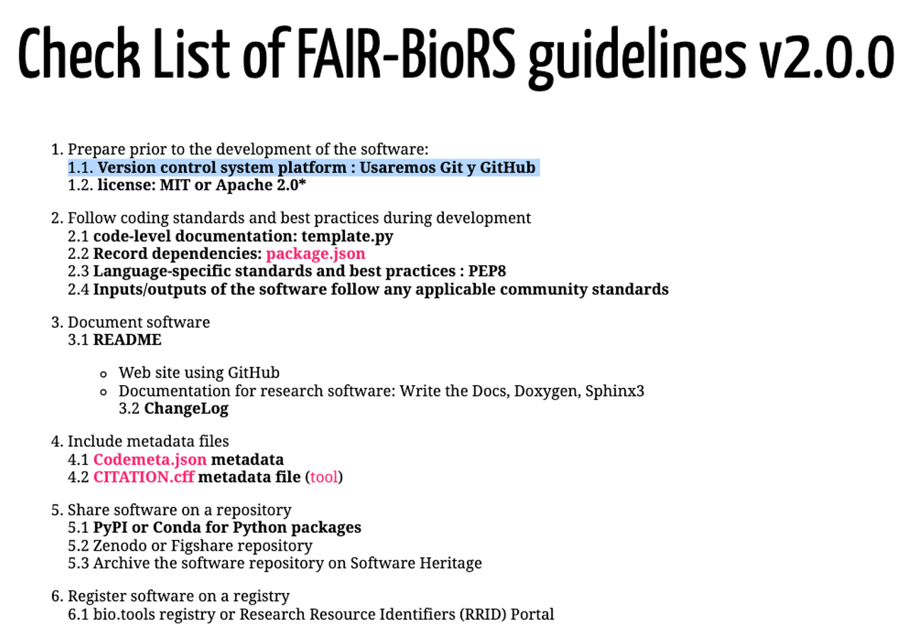
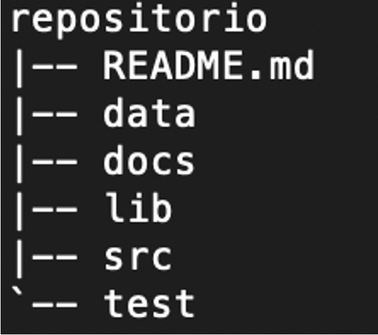
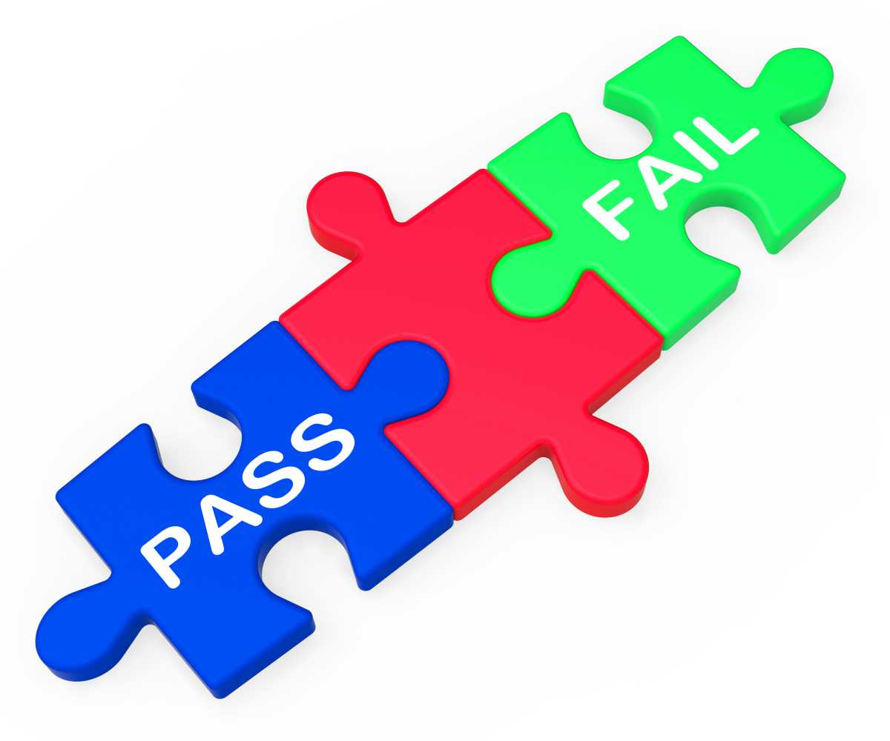

---
title: "Python II y GitHub"
--subtitle: "1. Buenas prácticas para el desarrollo de software colaborativo"
--author: ''
institute: "Licenciatura en Ciencias Genómicas, UNAM"
date: 'First version: 2021-08-03; Last update: `r Sys.Date()`'
output:
  xaringan::moon_reader:
    css: ["default", "default-fonts", "hygge"]
    lib_dir: libs
    includes:
      after_body: insert-logo.html
    nature:
      highlightStyle: github
      highlightLines: true
      countIncrementalSlides: false
      beforeInit: "macros.js"

---
```{r setup, include=FALSE}
knitr::opts_chunk$set(echo = FALSE)
```


```{css, echo = FALSE}
/* From https://github.com/yihui/xaringan/issues/147  */
.scroll-output {
  height: 80%;
  overflow-y: scroll;
}
/* https://stackoverflow.com/questions/50919104/horizontally-scrollable-output-on-xaringan-slides */
pre {
  max-width: 100%;
  overflow-x: scroll;
}
```


## Contenido

1. **Buenas prácticas para el desarrollo de software colaborativo**  

2. [Especificar versiones en Git con tag](./leccion1-etiquetas/1-Etiquetas.html)  

3. [Trabajar con ramas en Git: git branch](./leccion2-ramas/2-Ramas.html)  

4. [Manejo de issues en GitHub](./leccion3-issues/3-issues.html)  

5. [Gestión de un proyecto con GitHub](../leccion4-project/4-project.html)  


---

## FAIR-BioRS guidelines

Siguiendo las buenas prácticas....

```{r, out.width = "650px",fig.align='center'}

```


---

## Buenas prácticas para el desarrollo de software colaborativo

Pero antes, imaginemos que realizaremos un viaje de vacaciones.  

**¿qué debemos considerar? ¿qué es lo que debemos hacer?**  

```{r, out.width = "450px",fig.align='center'}

```

---

## Buenas prácticas para el desarrollo de software colaborativo

### 1. **Objetivo del viaje vs. Objetivo del proyecto**
   - **Viaje:** Antes de iniciar cualquier viaje, lo primero que decides es el destino. *¿A dónde quieres ir? ¿Qué quieres lograr durante tus vacaciones?*
   - **Proyecto:** De manera similar, en un proyecto, lo primero es definir los **objetivos**. ¿Qué problema resolverá? ¿Cuál es el resultado final esperado?  

### 2. **Itinerario vs. Plan de proyecto**
   - **Viaje:** Una vez definido el destino, necesitas planificar tu itinerario: los lugares que visitarás, las actividades que realizarás, el tiempo que dedicarás a cada una, etc.
   - **Proyecto:** En un proyecto, esto se traduce en la creación de un plan detallado que incluya las **tareas a realizar, los hitos importantes, los recursos necesarios y los plazos de entrega**  

---

### 3. **Recursos (presupuesto, transporte, hospedaje) vs. Recursos del proyecto**
   - **Viaje:** Determinas tu presupuesto, seleccionas el transporte, y reservas alojamiento. Todos estos recursos son necesarios para que el viaje sea exitoso.
   - **Proyecto:** De igual manera, en un proyecto de software, debes asignar recursos: tiempo, dinero, personal, y herramientas. Un presupuesto bien gestionado y la asignación correcta de recursos son cruciales para el éxito del proyecto.  
   
   
### 4. **Riesgos y Plan B**
   - **Viaje:** ¿Qué pasa si el vuelo se cancela o si el clima no es favorable? Tener un plan B y prever posibles contratiempos es parte importante de la planificación.
   - **Proyecto:** En un proyecto, identificar riesgos (como retrasos o problemas técnicos) y tener un plan de contingencia es esencial para evitar que el proyecto fracase.  

---

### 5. **Ejecución vs. Desarrollo**
   - **Viaje:** Durante el viaje, sigues tu itinerario, pero también necesitas ser flexible para ajustar sobre la marcha si algo no sale como planeado.
   - **Proyecto:** En la fase de desarrollo, sigues el plan del proyecto, pero también debes estar preparado para iterar y ajustar conforme surgen problemas o cambios de requisitos.  

### 6. **Evaluación del viaje vs. Evaluación del proyecto**
   - **Viaje:** Al final del viaje, evalúas cómo fue la experiencia: ¿cumpliste tus objetivos? ¿Fue satisfactorio?
   - **Proyecto:** Al concluir el proyecto, haces una revisión para ver si se lograron los objetivos, qué funcionó bien y qué se puede mejorar para futuros proyectos.

---

### Construcción de una casa

Ahora, comparemos la planificación de un proyecto de software con la construcción de una casa.  

Pensemos en la importancia de:  
- Tener un diseño arquitectónico detallado antes de comenzar la construcción  
- Cómo cada fase (estructura, acabados) debe seguir un orden lógico  
- Y cómo los recursos deben gestionarse de manera eficiente para evitar retrasos y sobrecostos  

```{r, out.width = "400px",fig.align='center'}

```

---

## Buenas prácticas para el desarrollo de software colaborativo

- Definir el proyecto a desarrollar    

- Contar con una estructura de trabajo  

- Elaboración del reporte del proyecto  

- Distribuir las cargas de trabajo con el equipo  

- Fomentar la comunicación entre el equipo  

- No nos olvidemos de ¡DOCUMENTAR!  


```{r, out.width = "300px",fig.align='center'}

```

---

## Buenas prácticas para el desarrollo de software colaborativo

- **Definir el proyecto a desarrollar**      

Paso 1: Proceder a definir con quién trabajaremos a lo largo del semestre.  

**EJERCICIO:** Conformaremos equipos. Registrar en el archivo excel **"PythonII-2026-1-equipos"** el nombre del equipo y los integrantes. ¡LISTO!  

Paso 2: Debemos conocer los diferentes datos a trabajar

**EJERCICIO:** Revisar a fondo los datos de cada fuente de referencia  

Paso 3: Analizar con mi equipo los proyectos y definir aquel en el que trabajaremos  

OJO: Antes de elegir, considerar la problemática a resolver, las posibles preguntas biologícas por formularse y los resultados esperados. ¡LISTO!  

**EJERCICIO:** Anotar en el archivo excel **"PythonII-2026-1-equipos"** el nombre del proyecto seleccionado, columna "Proyecto seleccionado" ¡LISTO!    

---


## Buenas prácticas para el desarrollo de software colaborativo

- *Contar con una estructura de trabajo*   

Paso 4: Antes de comenzar con en el proyecto, es necesario definir el espacio de trabajo en común.  

**EJERCICIO:** Crear un respositorio en GitHub. Define un nombre apropiado para el mismo.  

**EJERCICIO:** Agrega a tu compañero/a como colaborador/a  

**EJERCICIO:** Registra la URL de tu repositorio en el archivo excel **"PythonII-2026-1-equipos"** columna "Repositorio GitHub"  

**EJERCICIO:** Clonar el repositorio en sus máquinas. Recuerda usar git clone [https://] o desde GitHub Desktop  

---


## Buenas prácticas para el desarrollo de software colaborativo

- *Contar con una estructura de trabajo*   

**EJERCICIO:** Define y crea la estructura de directorios para el proyecto. Propuesta: 


```{r, out.width = "150px",fig.align='center'}

```

**EJERCICIO:** Documentar el archivo README.md donde se establezca el nombre del proyecto, descripción general del mismo, nombre de los participantes del equipo, forma de contacto, etc.    

**EJERCICIO:** Agregar una licencia el repositorio    

**EJERCICIO:** Sincronizar los cambios entre los integrantes del equipo  

**NOTA: Dividan el trabajo entre los integrantes del equipo. PUNTO A EVALUAR**  

---

## Buenas prácticas para el desarrollo de software colaborativo

Antes de comenzar a pensar en la solución que se dará al proyecto es necesario...

**Identificar las diferentes fases y actividades del proyecto**    

Por lo general, las fases de un proyecto de desarrollo de software contemplan:  

**- Planificación:** Entendimiento del problema, calendario de trabajo, definición de entregables.  

**- Especificación de requisitos: ** En esta fase se descubre todo lo que se espera por desarrollar; qué datos se van a manejar, de dónde vendrán, qué tipo de análisis se van a realizar, identificar las restricciones a considerar en cuanto a tecnologías, plataformas, manejo de los datos, etc., qué se desea obtener como producto final/resultados, cómo se debe presentar dicho resultado (formato, localización, etc.).  *Representa el QUÉ*  

```{r, out.width = "120px",fig.align='center'}
knitr::include_graphics("img/calendario.avif")
```

---

## Buenas prácticas para el desarrollo de software colaborativo

**- Análisis y Diseño:** En esta fase se estudian posibles alternativas para tratar la problemática planteada. Se analizan los requisitos e identifican las mejores *soluciones* para el proyecto. *Representa el CÓMO*    

**- Desarrollo:** En esta fase el equipo de desarrollo codifica el software necesario con base a los requerimientos iniciales y la solución planteada en la etapa anterior     


```{r, out.width = "400px",fig.align='center'}

```


---

## Buenas prácticas para el desarrollo de software colaborativo

**- Pruebas:** En esta fase el equipo realiza las pruebas necesarias para comprobar la funcionalidad del software/scripts y corregir errores    


**- Despliegue:** En esta fase el desarrollo propuesto y probabo se pone en marcha/operación! 


**- Mantenimiento:** Esta fase se enfoca a cambiar, modificar y actualizar el software para corregir defectos encontrados durante su uso o la adición de nuevas funcionalidades mejorando la usabilidad del mismo  

```{r, out.width = "300px",fig.align='center'}

```


---
## Buenas prácticas para el desarrollo de software colaborativo

- *Elaboración del Reporte del proyecto*  

De acuerdo con la etapa de **Planificación** comenzaremos con la definición de nuestro proyecto. Usaremos la **Plantilla para Reporte de proyecto**, este documento nos ayudará a aterrizar el proyecto de acuerdo a nuestra visión, y comenzar a organizar el trabajo que se llevará a cabo.   

**EJERCICIO:** Descarga el formato propuesto de la plataforma de cursos, archivo *Plantilla para Reporte de proyecto*. En equipo analicen el proyecto y documenten la Introducción y Planteamiento del problema

**NOTA 1: Dividan el trabajo entre los integrantes del equipo.**  

**NOTA 2: El archivo debe subirse a GitHub en la carpeta /docs.**  


---

## Buenas prácticas para el desarrollo de software colaborativo

**Especificación de requisitos**  

Este es el momento en que vamos a identificar las "funcionalidades" que requiere el desarrollo de software del proyecto; los datos que se deben manipular y analizar, así como la información que se debe producir.  

Estos requisitos representan la guía que describe las necesidades específicas a cumplir en el proyecto.  

Deben estar descritos de manera clara, precisa, y de tal manera que puedan ser verificables en su cumplimiento.  

```{r, out.width = "180px",fig.align='center'}
knitr::include_graphics("img/requisitos.png")
```

Dependiendo del tipo de proyecto se define el tiempo que se le puede asignar a esta etapa, pero en general, se recomienda dedicar aproximadamente el *20-25%* del tiempo total del proyecto.

---

## Buenas prácticas para el desarrollo de software colaborativo

**Especificación de requisitos**  

**EJERCICIO:** Usa el documento **Plantilla para Reporte de proyecto** para plasmar cada uno de los atributos que hemos detectado como requerimientos a cumplir, sección Metodología, incluyendo las __preguntas biológicas__.

**NOTA 1: Dividan el trabajo entre los integrantes del equipo.**  

**NOTA 2: El archivo debe subirse a GitHub en la carpeta /docs.** 


```{r, out.width = "460px",fig.align='center'}
knitr::include_graphics("img/requisitos.png")
```
---

## Buenas prácticas para el desarrollo de software colaborativo

**Análisis y Diseño**  

Un buen análisis y diseño permite una implementación más fluida y con menos errores. Invertir tiempo aquí reduce la complejidad en la etapa de codificación y minimiza los riesgos de reescritura de código.  

La descripción del análisis y diseño se puede apoyar con diagramas de flujo, de casos de uso, E/R, etc., así como de cualquier otro recurso que permita plasmar el flujo de acciones que permitan llegar a la solución de los requisitos del proyecto.  


```{r, out.width = "250px",fig.align='center'}

```

En esta etapa se recomienda dedicar alrededor del 25-30% del tiempo total del proyecto.
---
## Buenas prácticas para el desarrollo de software colaborativo

**Análisis y Diseño**  

**EJERCICIO:** En el documento **Plantilla para Reporte de proyecto**, sección "Metodología", define la __solución__ a cada una de las preguntas de investigación planteadas.   

**NOTA 1: Dividan el trabajo entre los integrantes del equipo.**  

**NOTA 2: El archivo debe subirse a GitHub en la carpeta /docs.** 


---


---
---
---
---
---
