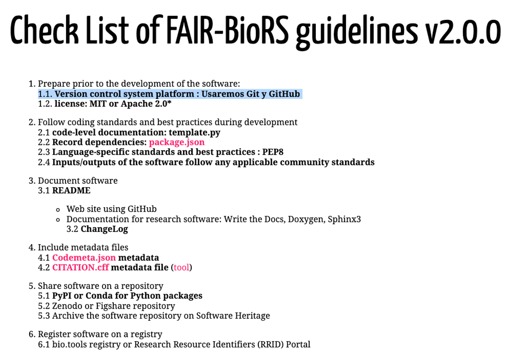

---
title: "Python II y GitHub"
--subtitle: "1. Buenas prácticas para el desarrollo de software colaborativo"
--author: ''
institute: "Licenciatura en Ciencias Genómicas, UNAM"
date: 'First version: 2021-08-03; Last update: `r Sys.Date()`'
output:
  xaringan::moon_reader:
    css: ["default", "default-fonts", "hygge"]
    lib_dir: libs
    includes:
      after_body: insert-logo.html
    nature:
      highlightStyle: github
      highlightLines: true
      countIncrementalSlides: false
      beforeInit: "macros.js"

---
```{r setup, include=FALSE}
knitr::opts_chunk$set(echo = FALSE)
```


```{css, echo = FALSE}
/* From https://github.com/yihui/xaringan/issues/147  */
.scroll-output {
  height: 80%;
  overflow-y: scroll;
}
/* https://stackoverflow.com/questions/50919104/horizontally-scrollable-output-on-xaringan-slides */
pre {
  max-width: 100%;
  overflow-x: scroll;
}
```


## Contenido

1. **Buenas prácticas para el desarrollo de software colaborativo**  

2. [Manejo de issues en GitHub](./leccion3-issues/3-issues.html)  

3. [Gestión de un proyecto con GitHub](../leccion4-project/4-project.html)  

4. [Especificar versiones en Git con tag](./leccion1-etiquetas/1-Etiquetas.html)  

5. [Trabajar con ramas en Git: git branch](./leccion2-ramas/2-Ramas.html)  


---

## FAIR-BioRS guidelines

Siguiendo las buenas prácticas....

```{r, out.width = "650px",fig.align='center'}

```


---

## Un proyecto también necesita una ruta

Antes de comenzar un viaje no hacemos la maleta y salimos sin rumbo.

Primero decidimos:

- A dónde queremos llegar
- Qué necesitamos
- Cómo nos organizaremos
- Qué haremos si algo cambia

```{r, out.width = "330px", fig.align = "center"}

```

.center[
### ¿Qué podría ocurrir si comenzamos un proyecto sin planearlo?
]
---
## 1. Definir el destino y trazar la ruta

| En un viaje | En un proyecto |
|:--|:--|
| Elegimos un destino | Definimos el problema y los objetivos |
| Decidimos qué lugares visitar | Identificamos resultados y entregables |
| Organizamos un itinerario | Dividimos el trabajo en actividades |
| Establecemos fechas | Definimos prioridades y plazos |

### Preguntas antes de comenzar

- ¿Qué problema queremos estudiar o resolver?
- ¿Qué resultado esperamos obtener?
- ¿Qué actividades nos permitirán alcanzarlo?
- ¿Cómo sabremos que el proyecto fue exitoso?

---
## 2. Preparar recursos y anticipar riesgos

| Recursos necesarios | Riesgos que debemos prever |
|:--|:--|
| Tiempo disponible | Datos inaccesibles o incompletos |
| Personas y responsabilidades | Actividades más complejas de lo esperado |
| Datos y espacio de almacenamiento | Dependencias o herramientas incompatibles |
| Software e infraestructura | Retrasos o integrantes no disponibles |
| Conocimientos técnicos | Cambios en el alcance del proyecto |

### Todo riesgo necesita una alternativa

> Si los datos, el tiempo o la solución original fallan,  
> ¿cómo puede continuar el proyecto?

**Ejemplo:** si no es viable analizar 500 genomas, se puede seleccionar un
subconjunto representativo utilizando criterios documentados.

---

## 3. Ejecutar, revisar y aprender

Un plan orienta el trabajo, pero **no es inamovible**.

- Saber qué se hizo y por qué.
- Evitar duplicar esfuerzos.
- Identificar la contribución de cada persona.
- Reproducir los resultados.
- Continuar el proyecto aunque cambie el equipo.

.center[
### Planificar → ejecutar → comprobar → documentar → mejorar
]

---

# Del plan a nuestro proyecto

Ya identificamos lo que necesita un proyecto ordenado.

Ahora aplicaremos esa ruta:

### 1. Formar el equipo  
### 2. Delimitar el proyecto  
### 3. Crear el espacio de trabajo  
### 4. Organizar y documentar

Al finalizar, cada equipo contará con un proyecto definido,
un repositorio compartido y una primera versión de su documentación. 


---
## EJERCICIO EN CLASE 1

# Confirmar el equipo y seleccionar el proyecto

### A. Confirmen su equipo

Cada equipo debe:

- Estar integrado por tres personas.
- Elegir un nombre.
- Acordar un medio de comunicación.

---

### B. Seleccionen el proyecto

Analicen:

- Problema biológico o computacional.
- Preguntas preliminares.
- Datos necesarios.
- Producto esperado.
- Viabilidad durante el semestre.

### Registren en el archivo PythonII-2027-1-equipos.xlsx

- Nombre del equipo.
- Integrantes.
- Proyecto seleccionado.

**Tiempo: 15 minutos**

---
## EJERCICIO EN CLASE 2

# Crear el repositorio del equipo

1. Una persona crea el repositorio en GitHub.
2. El equipo elige un nombre breve y descriptivo.
3. Agregan a las otras personas como colaboradoras.
4. Registran la URL en el archivo PythonII-2027-1-equipos.xlsx.
5. Cada integrante clona el repositorio.

```bash
git clone https://github.com/usuario/nombre-proyecto.git
cd nombre-proyecto
```
**Tiempo: 10 minutos**
---

## EJERCICIO EN CLASE 3

# Preparar el repositorio

Una estructura predecible permite localizar archivos y comprender el proyecto.

```text
proyecto/
├── data/
│   ├── raw/
│   └── processed/
├── docs/
├── notebooks/
├── results/
├── src/
├── tests/
├── .gitignore
└── README.md
```
---
### Antes de crearla, decidan:

- ¿Qué carpetas necesita realmente el proyecto?
- ¿Dónde estará el código?
- ¿Dónde se guardará la documentación?
- ¿Qué archivos no deben incluirse en Git?

> La estructura debe responder al proyecto; no es necesario conservar carpetas que no utilizarán.

Deben las opiniones de las personas que conforman el equipo de trabajo.  

Definina quién se encargará de crear la estructura. 

---
## EJERCICIO EN CLASE 3
# Incorporar la documentación inicial

Añadan al repositorio (plantillas disponibles en la plataforma de cursos.):

- `README.md`    
- `reporte-proyecto.md`    
- `.gitignore`
- `LICENSE`
---
## EJERCICIO EN CLASE 3

### Actividad

¡Dividan el trabajo! 

1. Incorporen las plantillas y resto de archivos en el lugar correspondiente.  
2. Seleccionen una licencia apropiada.
3. Confirmen los cambios.

```bash
git add .
git commit -m "docs: crear estructura y documentación inicial"
git push
```
No olviden subir y descargar los cambios.  


> La documentación comienza con el proyecto, no cuando el proyecto termina.

**Tiempo: 15 minutos**
---

# TAREA EN EQUIPO

# Primera definición del proyecto

Utilicen las plantillas incorporadas al repositorio.

### En el reporte completen:

- Contexto y planteamiento del problema.
- Justificación.
- Objetivo general.
- Preguntas de investigación preliminares.
- Alcance y limitaciones.
- Fuentes de datos.

> No completen resultados ni conclusiones. Marquen como pendiente la información que todavía no conozcan.

---
### En el README.md completen:

- Nombre y descripción breve.
- Estructura del repositorio.
- Equipo.
- Licencia.

> Marquen como pendiente la información que todavía no conozcan.


---

## TAREA — Productos que debe contener el repositorio

- [ ] README.md inicial.
- [ ] Reporte en `docs/reporte-proyecto.md`.
- [ ] Estructura de directorios adaptada.
- [ ] Archivo `.gitignore`.
- [ ] Licencia apropiada.
- [ ] Cambios sincronizados en GitHub.
- [ ] Participación identificable de las tres personas.

### Entrega

**Fecha:** 30/08/2026, 23:59  
**Medio:** repositorio registrado en PythonII-2027-1-equipos.xlsx  
**Modalidad:** un repositorio por equipo

> No se entrega un archivo adicional: revisaremos directamente el repositorio.

---

# Ya sabemos qué debemos construir

Tenemos:

- Un proyecto seleccionado.
- Un repositorio compartido.
- Plantillas de documentación.
- Una lista de entregables para la tarea por entregar.

Pero todavía necesitamos decidir:
- ¿Quién realizará cada actividad?  
- ¿Cómo sabremos qué está pendiente?  
- ¿Cómo daremos seguimiento al avance?  
- ¿Dónde registraremos dudas y decisiones?

En GitHub utilizaremos:

** - Issues** para definir el trabajo  
** - Projects** para organizarlo y darle seguimiento

---

